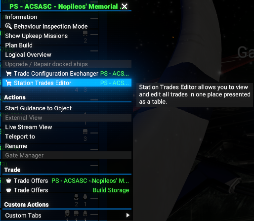
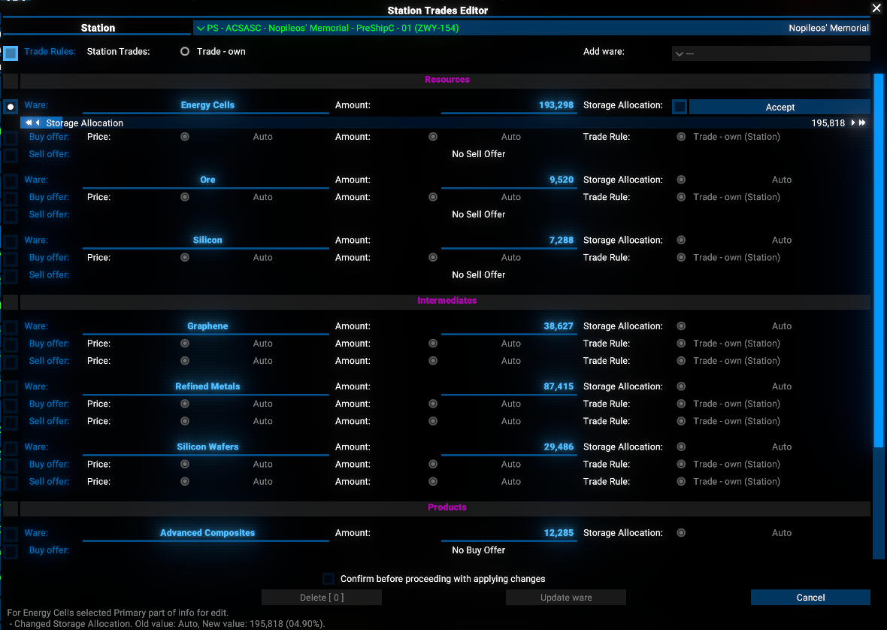
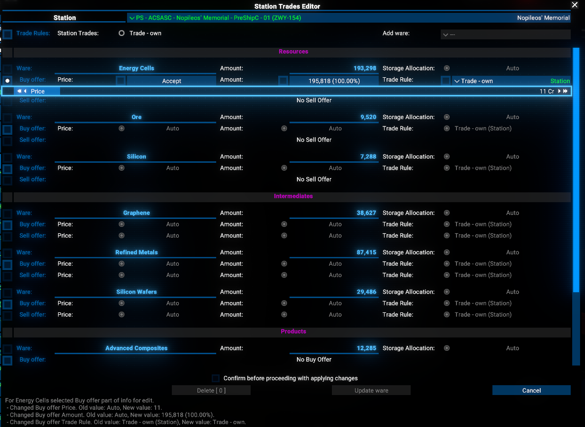
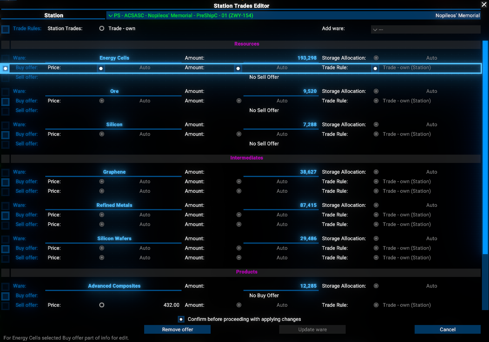
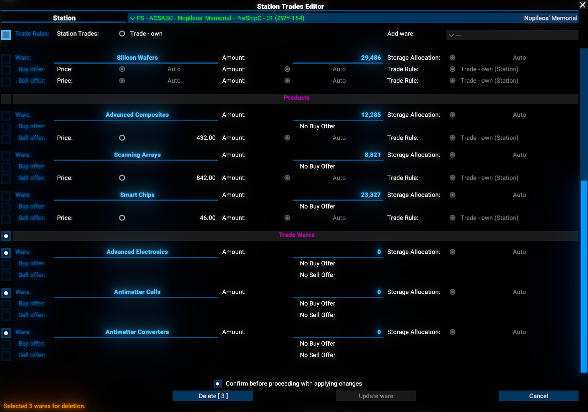

# Station Trades Editor

Station Trades Editor allows you to view and edit all trades in one place presented as a table.

## Features

- View and edit all trades of the selected trading station in one place.
- Edit station trade rules.
- Add new wares for trade.
- Selectable editing of ware storage allocations.
- Selectable editing of trade offers (buy and sell) per ware.
- Deletion of trade offers (buy and sell) per ware.

## Limitations

- Identifies trading stations as stations with cargo bays and without production modules. I.e. if your defense platform has cargo modules - it's will be identified as trading station.

## Requirements

- `X4: Foundations` 7.60 or newer (tested on 7.60 and 8.00).
- `Mod Support APIs` by [SirNukes](https://next.nexusmods.com/profile/sirnukes?gameId=2659) to be installed and enabled. Version `1.93` and upper is required.
  - It is available via Steam - [SirNukes Mod Support APIs](https://steamcommunity.com/sharedfiles/filedetails/?id=2042901274)
  - Or via the Nexus Mods - [Mod Support APIs](https://www.nexusmods.com/x4foundations/mods/503)

## Caution

**Please, be aware that is first public release version of the Station Trades Editor mod. Although it was tested in several scenarios, there may be some unforeseen issues or bugs.**

## Installation

You can download the latest version via Steam client - [Station Trades Editor](https://steamcommunity.com/sharedfiles/filedetails/?id=3628752347)
Or you can do it via the Nexus Mods - [Station Trades Editor](https://www.nexusmods.com/x4foundations/mods/1914)

## Usage

### How to call the Station Trades Editor

You can open the Station Trades Editor from the Stations Context Menu.

To do this, simply select a station on a `Map` or from `Property Owned` list, then right-click on it, and select `Station Trades Editor` from the context menu.

### Usage of the Station Trades Editor

The Station Trades Editor allows you to select the Station, and then configure it.

At the beginning only the Station is pre-selected as you opened the UI from its context menu. At any time you can change the Station by selecting another one from the `Station` dropdown list.

#### Main principles of the Station Trades Editor

- To start editing data in any row - you need to check the checkbox in the leftmost column of the table row. It is a common principle for all editable fields in the Station Trades Editor.
- Simple unchecked checkbox resumes values to the original ones.
- Numeric values are edited via the slider approach. I.e. you need press the button with the current value to open the slider, made the changes, and then press the `Accept` button to confirm the changes.
- Selectable values are edited via the dropdown list approach.
- After you made the desired changes - please select the confirmation checkbox at the bottom of the UI - `Confirm before proceeding with applying changes`.
- And then press the appropriate button to apply the changes.

#### Editing Station Trade Parameters

To edit the Station Trade Parameters, select the desired parameters from the top table. You can edit:

- Station Trade Rule Override - enable or disable the override for the station trade rules.
- Station Trade Rule - select the trade rule to apply to the station from the list of available trade rules.
- Add New Ware - add a new ware to the station trade list.

After you made the desired changes to the Station Trade Parameters - please select the confirmation checkbox at the bottom of the UI - `Confirm before proceeding with applying changes`. And then press the `Update Station` button to apply the changes to the station.

#### Editing Ware Storage Allocations

Again - to edit the Ware Storage Allocations - you need to check the checkbox in the leftmost column of the table row.
After you made it - the screen will be changed and checkbox which responsible for the enabling/disabling override of the ware storage allocation will be shown.

If you will uncheck the checkbox - the current value will be displayed as a button, pressing which will show for you the big slider to adjust the storage allocation value.

After you made the desired changes of the value - please press the `Accept` button to confirm the changes.

At the bottom of the UI - you can find the status bar which will inform you about the current status of your changes.

And then next - confirm the changes by selecting the confirmation checkbox at the bottom of the UI - `Confirm before proceeding with applying changes`. And then press the `Update Ware` button to apply the changes to the ware.

##### Editing the Trade Offers

The same principle is applied to the Trade Offers editing. You can edit both - `Buy Offer` and `Sell Offer` of the ware.

Numeric values are edited via the slider approach, the rules are selected from the dropdown list.

There is an example of editing the `Buy Offer` of the ware:

#### Deleting the Trade Offers

To delete the Trade Offers - you need to check the checkbox in the leftmost column of the table row and not making any changes to the ware parameters select the confirmation checkbox at the bottom of the UI - `Confirm before proceeding with applying changes`.

And then press the `Remove offer` button to delete the trade offer from the ware and station.

#### Deleting the Wares

There is possible to delete only the `Trade wares`, i.e. not `resource`, `intermediate`, or `product` wares can be deleted.

In addition - you can mark fro deletion all `Trade wares` at once. Simplely check the checkbox in the leftmost column of the `Trade wares` "header" row.

## Video

[Video demonstration of the Station Trades Editor. Version 1.00](https://www.youtube.com/watch?v=VtRy1gzz8Es)

## Credits

- Author: Chem O`Dun, on [Nexus Mods](https://next.nexusmods.com/profile/ChemODun/mods?gameId=2659) and [Steam Workshop](https://steamcommunity.com/id/chemodun/myworkshopfiles/?appid=392160)
- *"X4: Foundations"* is a trademark of [Egosoft](https://www.egosoft.com).

## Acknowledgements

- [EGOSOFT](https://www.egosoft.com) — for the X series.
- [SirNukes](https://next.nexusmods.com/profile/sirnukes?gameId=2659) — for the Mod Support APIs that power the UI hooks.
- [Forleyor](https://next.nexusmods.com/profile/Forleyor?gameId=2659) — for his constant help with understanding the UI modding! And especially for the help with resolving the scaling issue!

## Changelog

### [1.02] - 2025-12-26

- Fixed
  - Possible interference with the `Custom Tabs` mod by `mycu`
- Changed
  - Menu item icon

### [1.01] - 2025-12-24

- Fixed
  - Issue not able to be shown on wharfs or shipyards.
- Added
  - Possibility direct switch to `Stations Trade Config Exchanger`
  - Separate menu section in case of `UI Extensions and HUD` mod by `kuertee` is detected.
- Changed
  - Icon of the menu item in the context menu.

### [1.00] - 2025-12-22

- Added
  - Initial public version
